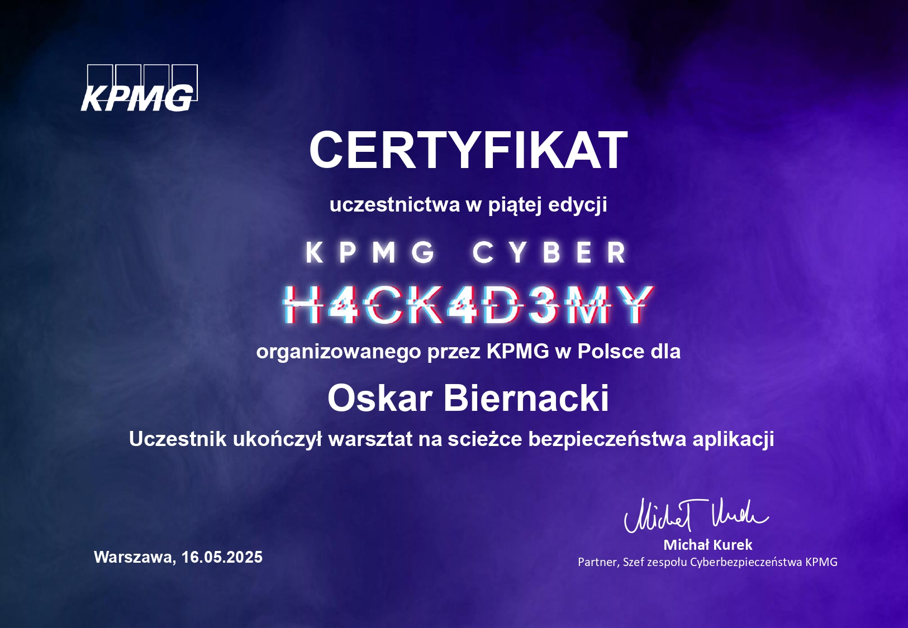

# Blog & Career Highlights

Welcome to my blog where I document important milestones in my cybersecurity journey — from organizing CTFs and delivering workshops to participating in conferences and specialized trainings.  
Each post is listed in **reverse chronological order**

---

## Career Timeline

---

### 🟩 2025-09-11 – Sekurak Hacking Party @ PJATK
Participated in the **Sekurak Hacking Party** hosted at PJATK Warsaw.  
Engaged in hands-on cybersecurity labs, network exploitation challenges, and live demonstrations of real-world attack scenarios presented by experienced security professionals.

---

### 🟩 2025-06-15 – JWT Security Presentation
Delivered a 60-minute presentation titled **“JWT Security Deep Dive”** to the PJATK Security Research Club (~60 attendees).  
Discussed token manipulation, signature bypasses, and mitigation strategies.

---

### 🟩 2025-06-08 – Co-organizing PJHACK 2025 CTF

I co-organized **PJHACK 2025**, a Capture The Flag competition with over 40 participants.  
I created 3 original challenges (Web, Reverse Engineering, and OSINT) and managed Docker-based infrastructure for the event.  
[Read more about the event](https://pja.edu.pl/znamy-zwyciezcow-pjhack-capture-the-flag-2025/)

---

### 🟩 2025-05-16 – Attending KPMG App Security Training

I participated in **hands-on workshops** focusing on OWASP Top 10 vulnerabilities, secure coding practices, and red teaming exercises.  
This training helped sharpen my practical web application testing skills.

---

## Stay Connected  

Thank you for following along on my journey in cybersecurity, CTFs, and professional growth.  
I regularly update this blog with new writeups, event summaries, and reflections on my projects.  

If you’d like to stay in touch or collaborate:  

- 📨 **Email:** [oskar.biernacki.it@gmail.com](mailto:oskar.biernacki.it@gmail.com)  
- 💼 **LinkedIn:** [linkedin.com/in/oskarbiernacki](https://www.linkedin.com/in/oskarbiernacki)  
- 🐙 **GitHub:** [github.com/OskarBiernacki](https://github.com/OskarBiernacki)  