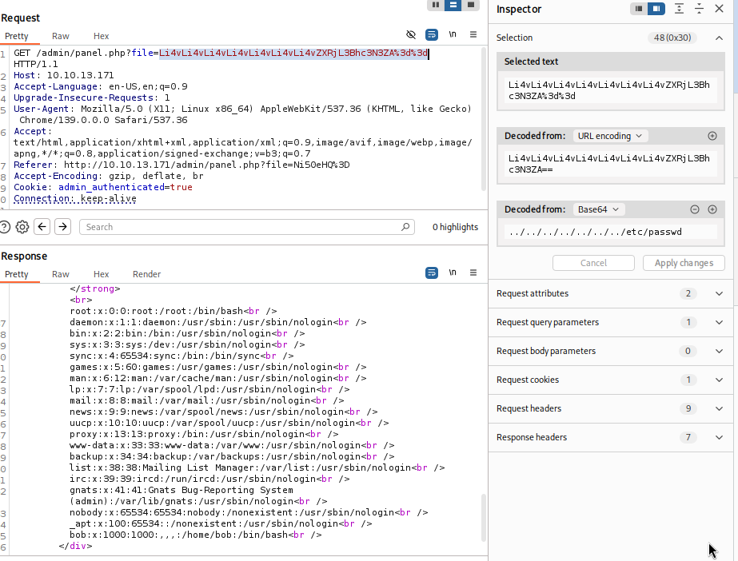

# onigirico writeup
---

author: Oskar Biernacki  
platform: TryHackMe  
url: https://tryhackme.com/room/onigirico

---

## Enumeration

We can enumerate it using gobuster, or just check the most popular `robots.txt`.

```
gobuster dir -w /usr/share/seclists/Discovery/Web-Content/directory-list-2.3-medium.txt -u "http://10.10.53.149/"
===============================================================
Gobuster v3.6
by OJ Reeves (@TheColonial) & Christian Mehlmauer (@firefart)
===============================================================
[+] Url:                     http://10.10.53.149/
[+] Method:                  GET
[+] Threads:                 10
[+] Wordlist:                /usr/share/seclists/Discovery/Web-Content/directory-list-2.3-medium.txt
[+] Negative Status codes:   404
[+] User Agent:              gobuster/3.6
[+] Timeout:                 10s
===============================================================
Starting gobuster in directory enumeration mode
===============================================================
/admin                (Status: 301) [Size: 312] [--> http://10.10.53.149/admin/]
/robots.txt           (Status: 200) [Size: 61] [--> http://10.10.53.149/robots.txt]
```

And the content of `/robots.txt`:
```
$ curl http://10.10.53.149/robots.txt        
User-Agent: *

Disallow: /admin
Disallow: /onigiri-shrimp.txt  
```

There is `/onigiri-shrimp.txt`, which is the answer for question #2, with interesting content:

```
$ curl http://10.10.53.149/onigiri-shrimp.txt
***NOTE***
Remember, this offer is only for special customers!!!
Shrimp is the best flavor!!!
bob, the secret ingredient recipe is in your home folder in secret.txt
***NOTE***

RECIPE:
Shrimp onigiri are low-calorie and suitable for those who follow a proper diet.
To make the dish even healthier, eliminate the use of sugar and replace rice vinegar with lemon juice.

Ingredients
!!!SECRET INGREDIENT!!!
round rice - 2 cups
water - 500 ml
shrimp - 200 g
nori - 1 sheet
rice vinegar - 2 teaspoons
sugar - to taste
salt - to taste
ground black pepper - to taste
sesame seeds - for decoration

Step-by-step cooking instructions

1. Rinse the rice well, cook until soft, let it cool slightly, season with salt, sugar, and rice vinegar.
2. Peel and cook the shrimp in salted water, then chop finely.
3. Finely chop the nori sheet with scissors to make flakes.
4. Add !!!SECRET INGREDIENT!!!
5. Shape the onigiri by hand or with a special triangular mold. To do this, place some shrimp on a layer of rice, cover with another layer of rice, press gently, and shape into a triangle. Place nori flakes on the shrimp in the middle 
``` 

We should remember only the important hint from this file:
`bob, the secret ingredient recipe is in your home folder in secret.txt`
So we somehow want to read this file.

---

## Breaking the login page

We can also access the previously enumerated `/admin`.


But brute force and simple SQL injection are not working. Let's investigate the login request.


As we can see, there is a suspicious cookie:  
`admin_authenticated=false`  
After changing it to  
`admin_authenticated=true`  
and refreshing the page, we bypass the login panel.

---
## Admin panel LFI

Now we have access to the admin panel. We can also read some messages. Let's use Burp Suite and intercept the request to read a message.


Burp automatically decodes the URL and base64-encoded `file` parameter.  
The decoded value of the file parameter is `5.txt`, so it may be an unprotected file read. Let's try reading `/etc/passwd` using the payload `../../../../../../../etc/passwd` encoded in base64 using Burp.



We can read files. And as we can see in the results of reading `/etc/passwd`, there is a user bob with a home directory `/home/bob`. As we remember, in the file `/onigiri-shrimp.txt` there was info about the file secret.txt in bob's home directory:

```bob, the secret ingredient recipe is in your home folder in secret.txt```

So using the payload `../../../../../../home/bob/secret.txt` we can try to read this file.


And that way, we got the flag.

---

## Conclusion
  What was done:
  * Enumeration  
  * Bypassed login by editing cookies  
  * LFI by file parameter while reading messages in the admin panel